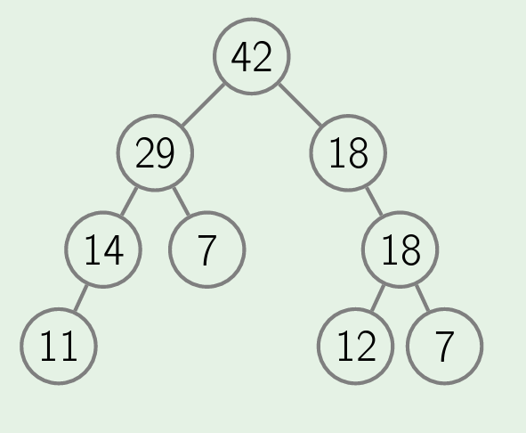
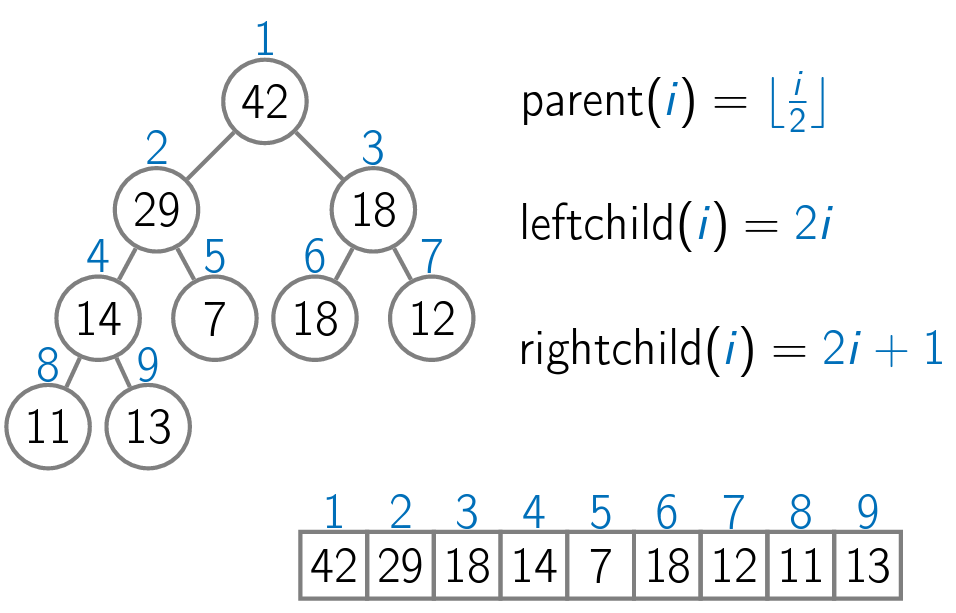

# <b>Priority Queues and Heaps</b>

## <b>Priority Queue</b>

A priority queue data structure is a generalization of the standard queue data structure. In the priority queue data structure, there is no such thing as the beginning or the end of a queue. Instead we have just a bag of elements, but each element is assigned a priority. When a new element arrives, we just put it inside this bag by calling the method Insert. However, when we need to process the next element from this bag, we call the method ExtractMax which is supposed to find an element inside this bag whose priority is currently maximum.

Priority queues are generally used in a lot of places such as in Prim's algorithm, Huffman's encoding algorithm etc.

## <b>Naive implementation of Priority Queues</b>

We can implement a priority queue using a simple array or linked list. One approach is, we always insert the element at end. Thus insertion takes O(1). But then to extract max element, we traverse throught the entire array thus leading to O(n). Another way is to use a sorted array. Thus, here extracting max element requires O(1), however insertion requires O(n), since first it has to locate the position using binary search and then shift to right all the elements by 1.

Thus, we introduce the data structure heap to implement priority queues mor efficiently.

## Heaps

Heaps is a beautiful data structure that allow to store the contents of a priority queue in a complete binary tree, which is in turn stored just as an array.

In a max heap, for all non-leaf node, the value stored in parent is always greater than or equal to value stored in child node.



Here, insertion and extracting maximum element both takes O(log(n)). During insertion, we can insert the new element as a leaf node and then shift it in tree as per the properties of heap. This is implemented by basic operations such as ```siftUp()``` and ```siftDown()```.

Further, this entire structure can be unwrapped as an array.



