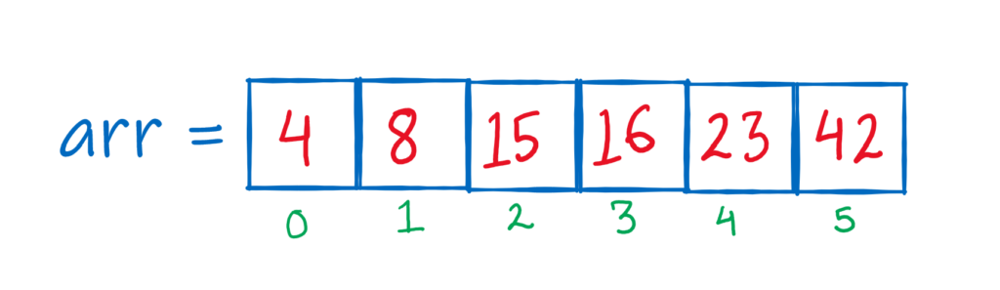
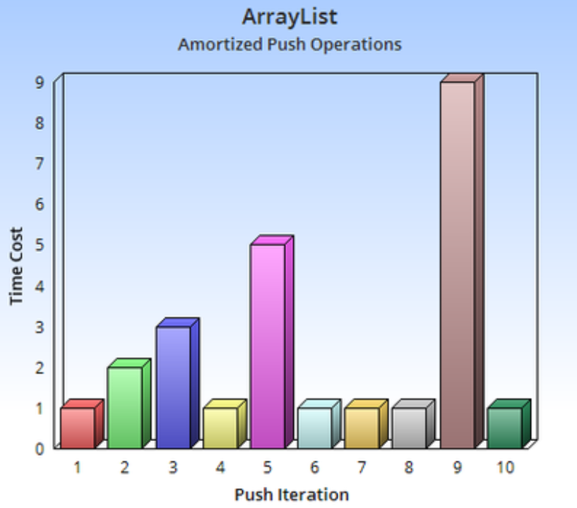
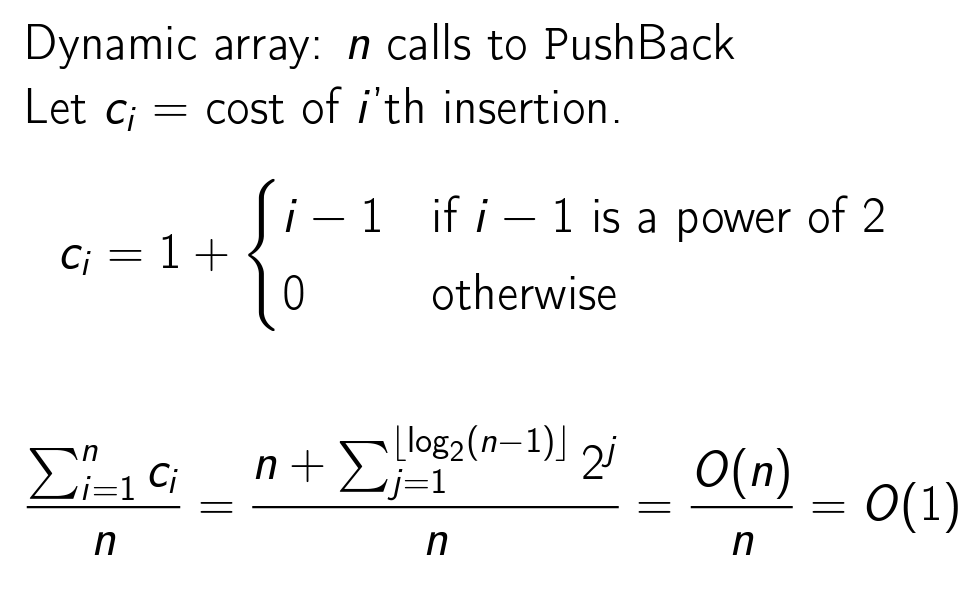
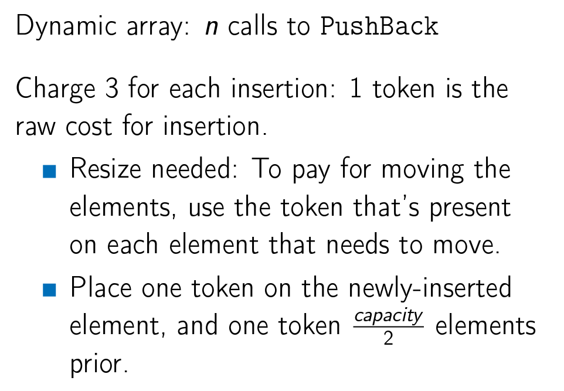
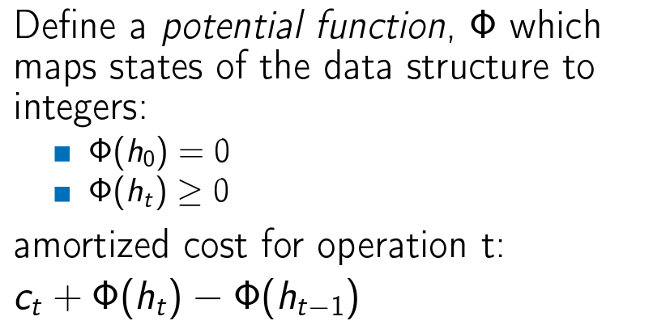
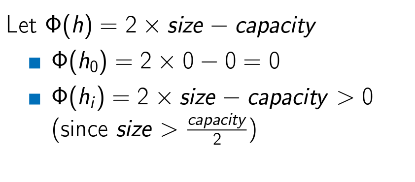
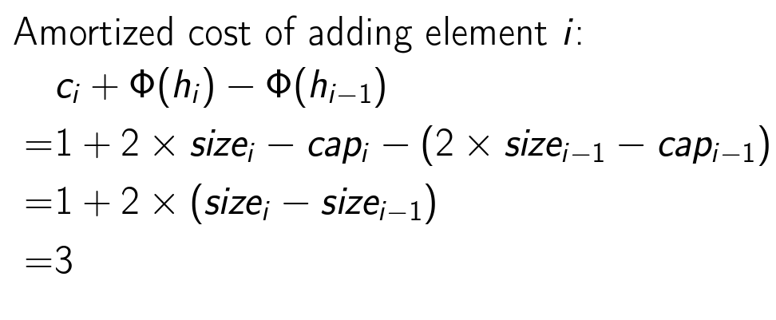
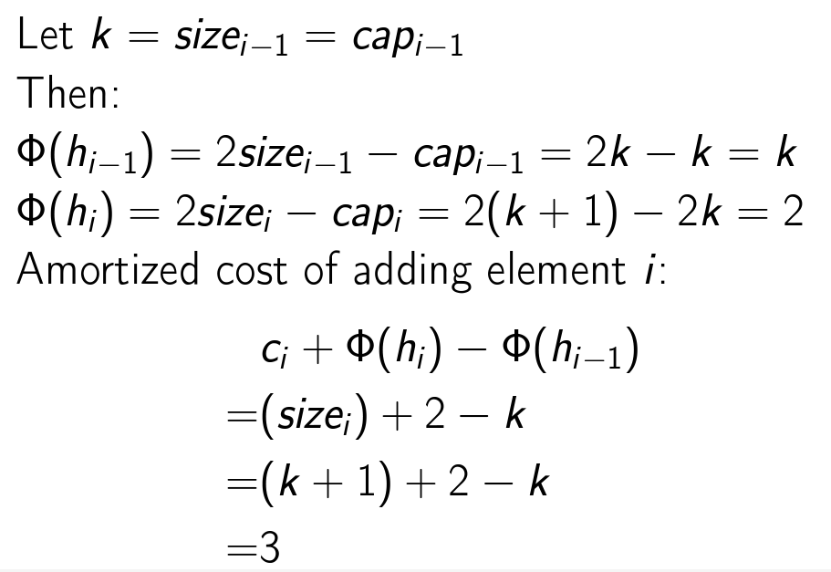

# Arrays



## Introduction

Arrays are a collection of elements stored in a contiguous block of memory, where all elements are of the same data type and are indexed by contiguous integers. This structure allows for quick access to elements, as both reading and writing can be done in constant time. Adding or removing an element at the end of the array is also a constant time operation. However, inserting or removing elements at the beginning or in the middle of an array takes linear time, i.e., `O(n)`, since elements need to be shifted. Additionally, arrays require a contiguous block of memory, which can be a limitation in some cases.

## <b>Dynamic Arrays</b>

The problem with static arrays is that they static. If we are reading a bunch of numbers and we need to put it in an array. But we don't know how many numbers there'll be. we just know there'll be some mark at the end that says we're done with the numbers.

So we use Dynamic arrays or Resizable arrays. Vectors are an example of dynamic arrays in `c++`

## <b>Amortized Analysis</b>

For the dynamic array, we only resize every so often. Most of the time, we're doing a constant time operation, just adding an element. It's only when we fully reach the capacity, that we have to resize. It is true that the worst case for PushBack() operation is O(n), but we have to bear this cost only when we reach to full capacity of array.



Amortized analysis is a method for analyzing a given algorithm's complexity, or how much of a resource, especially time or memory, it takes to execute. The motivation for amortized analysis is that looking at the worst-case run time can be too pessimistic. Instead, amortized analysis averages the running times of operations and considers both the expensive and cheap operations together over the whole sequence of operations.

### <b>Aggregate Method</b>



### <b>Banker Method</b>

In Bankers method, we associate certain fixed extra cost for all cheap operations, which will then compensate for the expensive operation.



Thus, associating cost of 3 with each cheap operation allows us to ignore the cost during resizing. Overall, we can claim that the cost for each operation is 3, or O(1).

### <b>Physicist Method</b>

This method is very similar to the concept of potential energy. If we go from lower level to higher level, potential energy increases. In a similar fashion, we have a potential function here. We expend ```h(t) - h (t-1)``` amount of work every time inserting an element.



The choice of potential function is important here. It should be made such that is ```Ct``` is small, potential function should increase at each step.


The general cost without resizing is: 

The general cost with resizing is: 


## <b>Points to note</b>

* It is important to resize the array by constant factor, say twice the bigger, rather than constant amount, say by 10 always. This is because if we increase by constant amount, the expensive operations can no more be compensated by cheap operations and runtime jumps to O(n).

* ```*size ++``` implies that size pointer should be incremented and then its value should be dereferenced, while ```(*size)++``` implies, increment the value stored in size.