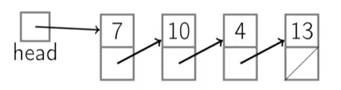

# Linked Lists 



## Introduction

Think of a traditional array where you allocate a fixed amount of space, like 100 elements, for your data. Even if you only use 20 elements, the other 80 spaces are wasted, and the size of the array can't change. If you need to add more data later, you could run out of space and have to resize the entire array, which can be inefficient and tricky.

A Linked List solves this problem. Instead of having a fixed-size block of memory, it allocates memory dynamically as needed. Each element in the list (called a "node") is created separately in memory, and each node contains two things:

* Data: the actual value the node holds.
* Pointer: the memory address of the next node in the list.

This way, a linked list can grow or shrink as needed without wasting memory, and you can insert or remove elements without worrying about resizing an array.

## Advantages & Disadvantages

Linked lists are not fixed in size. You can add or remove nodes at any time without worrying about running out of space or wasting memory. Also, inserting or deleting an element doesn't require shifting the entire structure (like in arrays). You just need to update a few pointers, making these operations fast.

However, each node requires extra memory for the pointer (address of the next node), which can make them more memory-hungry than arrays, especially for small data. To find an element, you have to start at the beginning and follow the links until you reach it. This is slower than accessing elements directly by index in an array.

Linked lists are a great choice when the size of the data is unknown or changes frequently. Since they can dynamically grow and shrink as needed, linked lists prevent the waste of memory that can occur in arrays, where you have to allocate a fixed amount of space. Additionally, linked lists are ideal for scenarios where fast insertions or deletions are required, especially when elements need to be added or removed in the middle of the list. Unlike arrays, which require shifting elements when inserting or deleting, linked lists only need to update a few pointers, making these operations more efficient.

Linked lists may not be the best option when fast access by index is a priority. In arrays, you can directly access any element using its index, but in a linked list, you have to traverse the list from the beginning to find the desired element, which can be slow. Furthermore, linked lists may not be ideal when memory is a concern. Each node in a linked list requires additional memory for the pointer, which can add up, especially in systems with limited memory or where extra space is at a premium.

## Types of Linked List

1) Singly Linked List
2) Doubly Linked List
3) Circular Linked List
4) Circular Doubly Linked List 

## Proof for Floyd Cycle Detection Algorithm


Here, we know that ```k``` has to be a node in the loop, only then can the slow pointer and fast pointer intersect. Now, the slow pointer may take ```m + Al + k``` steps and fast pointer may take ```m + Bl + k``` steps where ```A``` and ```B``` are constants which can be any number. The idea being that the slow or fast pointer might have to move full loops ```A``` or ```B``` times respectively before intersection, where ```B > A```. But we also know that,
```
fast = 2*slow
```
```
m + Bl + k = 2*(m + Al + k)
```
```
(B - 2A)l = m+k
```
```
constant*l = m+k
```
Thus, ```m+k = c*l```, where c is an integer constant.

This signifies that ```m+k``` steps are equivalent to looping ```c``` number of times in the loop and coming back to same position.

Now as per algorithm, we reset fast pointer to head, and make it now behave like slow. Doing this, it is guranteed that the next intersection point is the node which marks the start of cycle.

This is because, now the fast pointer has to take ```m``` steps to reach the first node of cycle. Thus, the slow pointer will make ```c*l - k``` steps. This ensures that the position of slow pointer after ```c*l - k``` steps will be the first node of cycle.